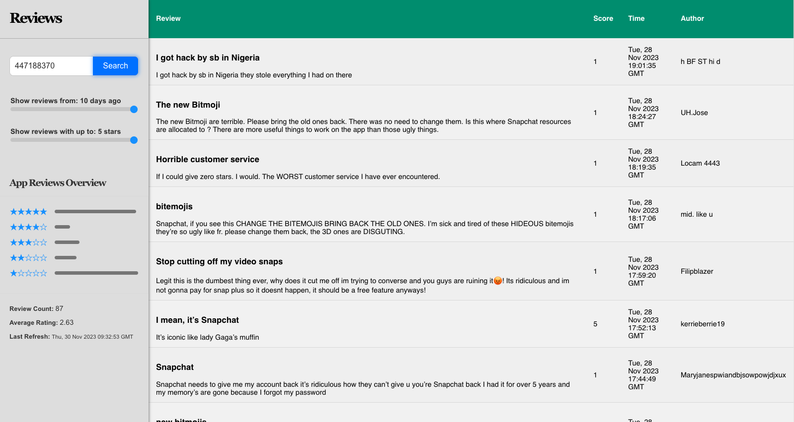

# App Reviews

This app is a small tool for querying, viewing, and filtering through application reviews on the iOS store given an application ID. The app:

- Persists review data in a postgres database
- Can be stopped and restarted without losing any data
- Displays new reviews along with metadata with a filter control for reviews up to 10 days

Extra Credit

- Users can search for reviews by entering an app ID.
- Reviews can be filtered based on star ratings and review age.
- The application provides a quick statistical overview of reviews.
- Cron job and backfilling for reviews data
- Testing

# How it works

The application requires three services:

- Frontend (written in React, running on port 3000 by default)
    - run ‘npm start’ in the /frontend directory
- Backend (written in Python, running on port 5000 by default)
    - cd into /python_backend and install / instantiate poetry shell
    - run python [app.py](http://app.py) in the /python_backend directory
- Postgres
    - user must install on system separately, should be running on port 5432 by default

High-Level Requirements

- React for the frontend
- Poetry as package manager
- Flask as backend framework
- Sqlalchemy for ORM interfacing with postgres
- Postgres

More granular list of dependencies can be found on the node_module directory in the frontend service and the poetry.lock file in the backend services

## Frontend Implementation

### Overview

This React application displays user reviews for various apps. It consists of two main components: **`Sidebar`** and **`Feed`**.

### **`Feed` Component**

Displays the list of reviews in a tabular format.

### Props

- **`filteredReviews`**: Array of review objects to display.

### Features

- Presents reviews in a table with columns for review content, score, timestamp, and author.
- Dynamically updates as per the filtered reviews passed through props.

### **`Sidebar` Component**

Handles user interactions for filtering and fetching reviews.

### State Variables

- **`inputValue`**: Stores the current input in the search bar.
- **`starFilter`**, **`daysFilter`**: Control the range of star ratings and the time period for reviews.
- **`reviewCount`**, **`averageRating`**, **`lastRefresh`**: Display metadata about the current set of reviews.

### Event Handlers

- **`handleInputChange`**: Updates **`inputValue`** on user input.
- **`handleSearchClick`**: Fetches and updates reviews based on the app ID input.
- **`handleStarFilterChange`**, **`handleDayFilterChange`**: Apply respective filters to the reviews.

### API Calls

- **`fetchReviewsData`**: Fetches reviews from a specified endpoint.

### Helper Functions

- **`applyStarFilter`**, **`applyDayFilter`**: Filter reviews based on star ratings and time period.
- **`updateMetadata`**: Updates review count and average rating.
- **`updateRatingsChart`**: Updates the visual representation of ratings distribution.

### **`App` Component**

The root component that initializes and renders the **`Sidebar`** and **`Feed`** components.

### State Variables

- **`reviews`**: Stores the complete list of fetched reviews.
- **`filteredReviews`**: Stores the currently filtered set of reviews to display.

# **Backend Implementation**

## **Overview**

The backend of the application focuses on fetching, processing, and serving app reviews data. It involves interaction with the iOS reviews RSS feed, data processing, and a Flask API to communicate with the frontend.

### **Key Components**

### **`AppReviews`** Class

- Defined in **`reviews_model.py`**, this class represents the app reviews database model.
- Includes methods for fetching (**`get_reviews`**) and updating (**`update_reviews`**) reviews data.

### **`poll_reviews`** Function

- A cron job function that regularly polls for new reviews.
- Invoked periodically to update the database with fresh data from the iOS reviews RSS feed.

### **`parse_rss`** Function

- Located in **`utils`**, it parses the JSON payload from the RSS feed.
- Converts the data into a clean format suitable for database storage.

### Flask API Endpoints

- **`/get_reviews`**: Fetches reviews for a specific app ID, applying an optional time filter.

### Testing
- Navigate to the tests directory and run python tests.py to run the unittest battery

### **Database Interaction**

- IMPORTANT: Change the POSTGRES CONNECTION STRING constant in the config.py file to your own local postgres credentials otherwise db won't connect
- Utilizes SQLAlchemy for ORM.
- Manages database sessions and connections.
- **`update_scan`** method for updating reviews across all apps in the database.

### **Configuration**

- TODO: Database connection string and other configurations should be moved to a separate config file for better management.

## **Usage**

- Run the Flask server to enable API endpoints.
- **`poll_reviews`** should be scheduled as a cron job for automatic updates.

### **Notes for Developers**

- Ensure that the database schema is aligned with the **`AppReviews`** class structure.
- Regularly monitor the performance of the cron job and optimize as needed.

## **Database (postgres)**

- you should have postgres running locally on port 5432.
- To get tables set up run reviews_model.py in the backend as the main while uncommenting the line for initialization

## Todo

- Better error handling and logging
- DRY up some of the frontend code and refactor
